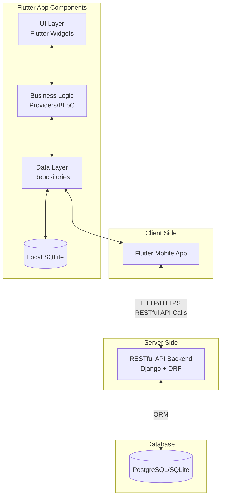
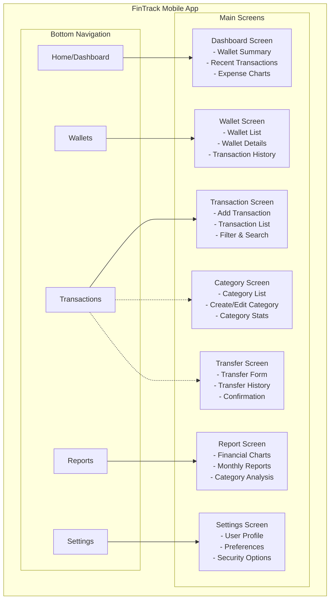
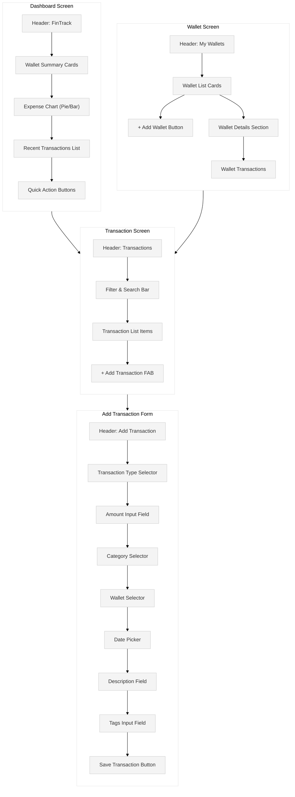
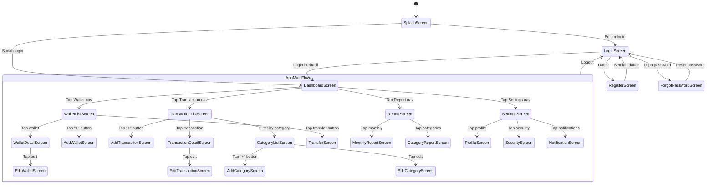

# Deskripsi Aplikasi

## Personal Finance Tracker berbasis Flutter

### 1. Pendahuluan

#### 1.1 Latar Belakang

Pengelolaan keuangan pribadi menjadi salah satu aspek penting dalam kehidupan sehari-hari yang sering terabaikan. Banyak individu kesulitan melacak pengeluaran, menetapkan anggaran, dan menganalisis pola pengeluaran mereka. Meskipun saat ini sudah banyak aplikasi manajemen keuangan, namun sebagian besar terlalu kompleks dan tidak berfokus pada kebutuhan pengguna individu.

FinTrack dikembangkan untuk menjembatani kesenjangan ini dengan menyediakan aplikasi mobile yang sederhana, intuitif, namun tetap komprehensif dalam membantu pengguna mengelola keuangan pribadi mereka. Aplikasi ini akan berfokus pada pencatatan transaksi harian, pelacakan anggaran, dan visualisasi tren pengeluaran.

#### 1.2 Tujuan Aplikasi

- Menyediakan platform mudah digunakan untuk melacak pemasukan dan pengeluaran harian
- Memungkinkan pengguna mengelola berbagai jenis dompet/rekening (cash, bank, e-wallet)
- Memberikan visualisasi data keuangan yang informatif untuk membantu pengambilan keputusan
- Memfasilitasi kategorisasi transaksi untuk analisis yang lebih baik
- Mendukung fitur transfer antar rekening/dompet
- Menyediakan laporan keuangan periodik

#### 1.3 Target Pengguna

- Individu berusia 18-45 tahun yang ingin mengelola keuangan pribadi
- Profesional muda yang membutuhkan alat pelacakan keuangan sederhana
- Individu yang ingin membangun kebiasaan manajemen keuangan yang baik
- Pengguna yang memiliki beberapa rekening/dompet digital berbeda

### 2. Analisis Kebutuhan

#### 2.1 Kebutuhan Fungsional

1. **Manajemen Dompet/Rekening (Wallet)**
	- Membuat, melihat, mengedit, dan menonaktifkan dompet
	- Mendukung berbagai jenis dompet (tunai, rekening bank, e-wallet, kartu kredit)
	- Pelacakan saldo secara real-time
2. **Pencatatan Transaksi**
	- Mencatat pemasukan, pengeluaran, dan transfer
	- Kategorisasi transaksi
	- Penambahan deskripsi dan tag untuk transaksi
	- Pemilihan tanggal transaksi
3. **Kategorisasi**
	- Pembuatan kategori kustom untuk pemasukan dan pengeluaran
	- Penggunaan ikon dan warna untuk identifikasi visual kategori
4. **Tag dan Pengelompokan**
	- Penambahan tag pada transaksi untuk pengelompokan yang lebih spesifik
	- Mencari transaksi berdasarkan tag
5. **Transfer Antar Rekening**
	- Pencatatan transfer antar rekening/dompet
	- Perhitungan biaya transfer otomatis
	- Penyesuaian saldo otomatis di kedua rekening terkait
6. **Laporan dan Analitik**
	- Ringkasan keuangan (pemasukan, pengeluaran, saldo)
	- Laporan bulanan
	- Pengeluaran berdasarkan kategori
	- Visualisasi tren keuangan
7. **Autentikasi dan Keamanan**
	- Login aman dengan username/password
	- Opsi keamanan tambahan seperti PIN atau biometrik
	- Penyimpanan data terenkripsi

#### 2.2 Kebutuhan Non-Fungsional

1. **Performa**
	- Waktu respons aplikasi kurang dari 2 detik
	- Sinkronisasi data yang efisien dengan server backend
2. **Keamanan**
	- Enkripsi data sensitif
	- Autentikasi yang aman
	- Perlindungan dari serangan umum
3. **Usabilitas**
	- Antarmuka yang intuitif dan mudah digunakan
	- Alur pengguna yang efisien untuk operasi umum
	- Aksesibilitas untuk berbagai pengguna
4. **Reliabilitas**
	- Fungsionalitas offline
	- Mekanisme pencadangan dan pemulihan data
5. **Skalabilitas**
	- Kemampuan menangani pertumbuhan jumlah data transaksi

### 3. Arsitektur Aplikasi

#### 3.1 Arsitektur Sistem

#### 3.2 Komponen Aplikasi Mobile

1. **Lapisan Presentasi (UI/UX)**
	- Halaman UI dibuat dengan Flutter
	- State Management dengan Provider atau Bloc
	- Widget kustom untuk komponen yang dapat digunakan kembali
2. **Lapisan Bisnis (Business Logic)**
	- Service untuk komunikasi dengan API
	- Model data untuk representasi entitas
	- Provider atau BLoC untuk manajemen state
3. **Lapisan Data (Data Layer)**
	- API Client untuk komunikasi dengan RESTful API
	- Local database untuk penyimpanan offline (SQLite)
	- Repository untuk abstraksi sumber data

#### 3.3 Backend dan API

Aplikasi akan menggunakan backend RESTful API yang sudah ada dan telah dianalisis dalam dokumen API. Backend ini memiliki endpoint yang sesuai untuk semua operasi yang dibutuhkan, termasuk:

- Manajemen Wallet
- Transaksi keuangan
- Kategori dan Tag
- Transfer antar wallet
- Laporan dan analitik

### 4. Desain Antarmuka Pengguna

#### 4.1 Desain Visual dan UX

- **Skema Warna**: Kombinasi warna biru dan putih untuk menciptakan nuansa profesional dan menenangkan.
- **Tipografi**: Font sans-serif untuk keterbacaan yang baik pada perangkat mobile.
- **Navigasi**: Bottom navigation bar untuk akses cepat ke fitur utama.
- **Layout**: Desain yang bersih dengan fokus pada data dan visualisasi.

#### 4.2 Wireframe Utama

#### 4.3 Detail Halaman Utama

1. **Halaman Beranda/Dashboard**
	- Ringkasan saldo semua dompet
	- Grafik tren pengeluaran/pemasukan
	- Transaksi terbaru
	- Tombol cepat untuk menambah transaksi
2. **Halaman Dompet (Wallet)**
	- Daftar semua dompet dengan saldo
	- Detail dompet dan histori transaksi
	- Opsi untuk menambah, mengedit, atau menonaktifkan dompet
3. **Halaman Transaksi**
	- Form untuk menambah transaksi baru
	- Filter dan pencarian transaksi
	- Daftar transaksi dengan filter dan pengurutan
4. **Halaman Kategori**
	- Daftar kategori dengan ikon dan warna
	- Form untuk menambah/mengedit kategori
	- Statistik penggunaan kategori
5. **Halaman Transfer**
	- Form untuk transfer antar rekening
	- Histori transfer
	- Konfirmasi transfer
6. **Halaman Laporan**
	- Grafik dan visualisasi data keuangan
	- Filter berdasarkan periode waktu
	- Ekspor laporan
7. **Halaman Pengaturan**
	- Preferensi pengguna
	- Manajemen akun
	- Opsi keamanan

### 5. Fitur dan Implementasi

#### 5.1 Fitur Utama dan MVP (Minimum Viable Product)

**Fase 1: MVP (Versi 1.0)**
1. **Autentikasi Pengguna**
	- Login/Register
	- Keamanan dasar
2. **Manajemen Dompet Dasar**
	- Membuat, melihat dompet
	- Melihat saldo dan riwayat transaksi
3. **Pencatatan Transaksi Dasar**
	- Menambah pengeluaran dan pemasukan
	- Kategorisasi dasar
4. **Dashboard Sederhana**
	- Tampilan saldo
	- Daftar transaksi terbaru

**Fase 2: Fitur Tambahan (Versi 1.5)**
1. **Kategori dan Tag Lanjutan**
	- Manajemen kategori kustom
	- Tag untuk pengelompokan
2. **Transfer Antar Dompet**
	- Implementasi fitur transfer
	- Perhitungan biaya dan saldo otomatis
3. **Laporan Dasar**
	- Ringkasan bulanan
	- Pengeluaran per kategori

**Fase 3: Fitur Lengkap (Versi 2.0)**
1. **Visualisasi Data Lanjutan**
	- Grafik dan chart interaktif
	- Tren dan pola pengeluaran
2. **Fitur Offline**
	- Sinkronisasi data yang lebih baik
	- Pengalaman offline penuh
3. **Ekspor Data**
	- Ekspor laporan ke PDF/CSV
	- Berbagi ringkasan keuangan

#### 5.2 Implementasi Teknis

1. **State Management**
	- Provider atau Bloc untuk manajemen state
	- Memisahkan UI dan logika bisnis
2. **Penyimpanan Lokal**
	- SQLite untuk penyimpanan lokal
	- Shared Preferences untuk pengaturan
3. **Jaringan dan API**
	- Dio atau http package untuk panggilan API
	- Interceptor untuk menangani token dan kesalahan
	- Sinkronisasi data yang efisien
4. **Komponen UI Kustom**
	- Widget yang dapat digunakan kembali
	- Animasi dan transisi
5. **Keamanan**
	- Enkripsi data sensitif
	- Biometrik untuk keamanan tambahan

### 6. Teknologi dan Stack

#### 6.1 Teknologi Frontend

- **Framework**: Flutter 3.0+
- **Bahasa**: Dart 3.0+
- **State Management**: Provider/Bloc
- **HTTP Client**: Dio
- **Local Storage**: SQLite, Shared Preferences
- **Navigasi**: Flutter Navigator 2.0
- **Charts/Graphs**: fl_chart atau syncfusion_flutter_charts
- **Autentikasi**: flutter_secure_storage untuk token

#### 6.2 Teknologi Backend (Sudah Ada)

- **Framework**: Django + Django REST Framework
- **Database**: SQLite/PostgreSQL
- **Autentikasi**: JWT (JSON Web Token)

#### 6.3 Tools Pengembangan

- **IDE**: Android Studio / VS Code
- **Version Control**: Git
- **Design**: Figma
- **Testing**: Flutter Test Framework
- **CI/CD**: GitHub Actions / Codemagic

### 8. Strategi Pengujian

#### 8.1 Jenis Pengujian

- **Unit Testing**: Pengujian komponen individual
- **Widget Testing**: Pengujian UI dan interaksi
- **Integration Testing**: Pengujian antar komponen
- **End-to-End Testing**: Pengujian alur pengguna lengkap
- **Usability Testing**: Pengujian dengan pengguna nyata

#### 8.2 Metrik Kualitas

- **Code Coverage**: Target minimal 80%
- **Performance Metrics**: Waktu muat < 2 detik
- **Crash Rate**: < 0.5%
- **User Satisfaction**: > 4/5 berdasarkan umpan balik

### 9. Kesimpulan

Aplikasi FinTrack akan menjadi solusi komprehensif untuk manajemen keuangan pribadi yang menawarkan pengalaman pengguna yang sederhana namun powerful. Dengan memanfaatkan backend RESTful API yang sudah ada dan kekuatan Flutter untuk pengembangan cross-platform, aplikasi ini akan memberikan pengalaman yang konsisten dan berkualitas tinggi.

Dengan fokus pada kemudahan penggunaan, visualisasi data yang informatif, dan fitur keuangan yang komprehensif, FinTrack bertujuan untuk membantu pengguna mendapatkan kontrol yang lebih baik atas keuangan mereka. Pendekatan pengembangan bertahap memastikan bahwa kita dapat memberikan nilai kepada pengguna sejak awal sambil terus menyempurnakan dan menambahkan fitur yang lebih canggih.

### Lampiran

#### Lampiran A: Daftar Endpoint API Utama

##### Endpoint Autentikasi

|Metode|Endpoint|Deskripsi|
|---|---|---|
|POST|`/api/v1/auth/register/`|Pendaftaran pengguna baru|
|POST|`/api/v1/auth/login/`|Login pengguna|
|POST|`/api/v1/auth/logout/`|Logout pengguna|
|PUT|`/api/v1/auth/password/change/`|Mengubah password|
|POST|`/api/v1/auth/password/reset/`|Reset password|
|GET|`/api/v1/auth/profile/`|Mendapatkan profil pengguna|
|PUT|`/api/v1/auth/profile/`|Mengupdate profil pengguna|
|POST|`/api/v1/auth/token/refresh/`|Memperbaharui token autentikasi|

##### Endpoint Wallet (Dompet)

|Metode|Endpoint|Deskripsi|
|---|---|---|
|GET|`/api/v1/finance/wallets/`|Daftar semua wallet|
|POST|`/api/v1/finance/wallets/`|Membuat wallet baru|
|GET|`/api/v1/finance/wallets/{id}/`|Detail wallet|
|PUT|`/api/v1/finance/wallets/{id}/`|Mengupdate wallet|
|DELETE|`/api/v1/finance/wallets/{id}/`|Menghapus wallet|
|POST|`/api/v1/finance/wallets/{id}/recalculate/`|Menghitung ulang saldo wallet|

##### Endpoint Kategori

|Metode|Endpoint|Deskripsi|
|---|---|---|
|GET|`/api/v1/finance/categories/`|Daftar semua kategori|
|POST|`/api/v1/finance/categories/`|Membuat kategori baru|
|GET|`/api/v1/finance/categories/{id}/`|Detail kategori|
|PUT|`/api/v1/finance/categories/{id}/`|Mengupdate kategori|
|DELETE|`/api/v1/finance/categories/{id}/`|Menghapus kategori|
|GET|`/api/v1/finance/categories/income/`|Daftar kategori pemasukan|
|GET|`/api/v1/finance/categories/expense/`|Daftar kategori pengeluaran|

##### Endpoint Transaksi

|Metode|Endpoint|Deskripsi|
|---|---|---|
|GET|`/api/v1/finance/transactions/`|Daftar semua transaksi|
|POST|`/api/v1/finance/transactions/`|Membuat transaksi baru|
|GET|`/api/v1/finance/transactions/{id}/`|Detail transaksi|
|PUT|`/api/v1/finance/transactions/{id}/`|Mengupdate transaksi|
|DELETE|`/api/v1/finance/transactions/{id}/`|Menghapus transaksi|
|GET|`/api/v1/finance/transactions/summary/`|Ringkasan transaksi|
|GET|`/api/v1/finance/transactions/by_category/`|Transaksi berdasarkan kategori|
|GET|`/api/v1/finance/transactions/monthly_report/`|Laporan bulanan|

##### Endpoint Transfer

|Metode|Endpoint|Deskripsi|
|---|---|---|
|GET|`/api/v1/finance/transfers/`|Daftar semua transfer|
|POST|`/api/v1/finance/transfers/`|Membuat transfer baru|
|GET|`/api/v1/finance/transfers/{id}/`|Detail transfer|
|PUT|`/api/v1/finance/transfers/{id}/`|Mengupdate transfer|
|DELETE|`/api/v1/finance/transfers/{id}/`|Menghapus transfer|

##### Endpoint Tag

|Metode|Endpoint|Deskripsi|
|---|---|---|
|GET|`/api/v1/finance/tags/`|Daftar semua tag|
|POST|`/api/v1/finance/tags/`|Membuat tag baru|
|GET|`/api/v1/finance/tags/{id}/`|Detail tag|
|PUT|`/api/v1/finance/tags/{id}/`|Mengupdate tag|
|DELETE|`/api/v1/finance/tags/{id}/`|Menghapus tag|
|GET|`/api/v1/finance/tags/{id}/transactions/`|Transaksi dengan tag tertentu|

#### Lampiran B: Rencana Wireframe (Konsep Awal)

#### Lampiran C: Skema Navigasi Aplikasi

